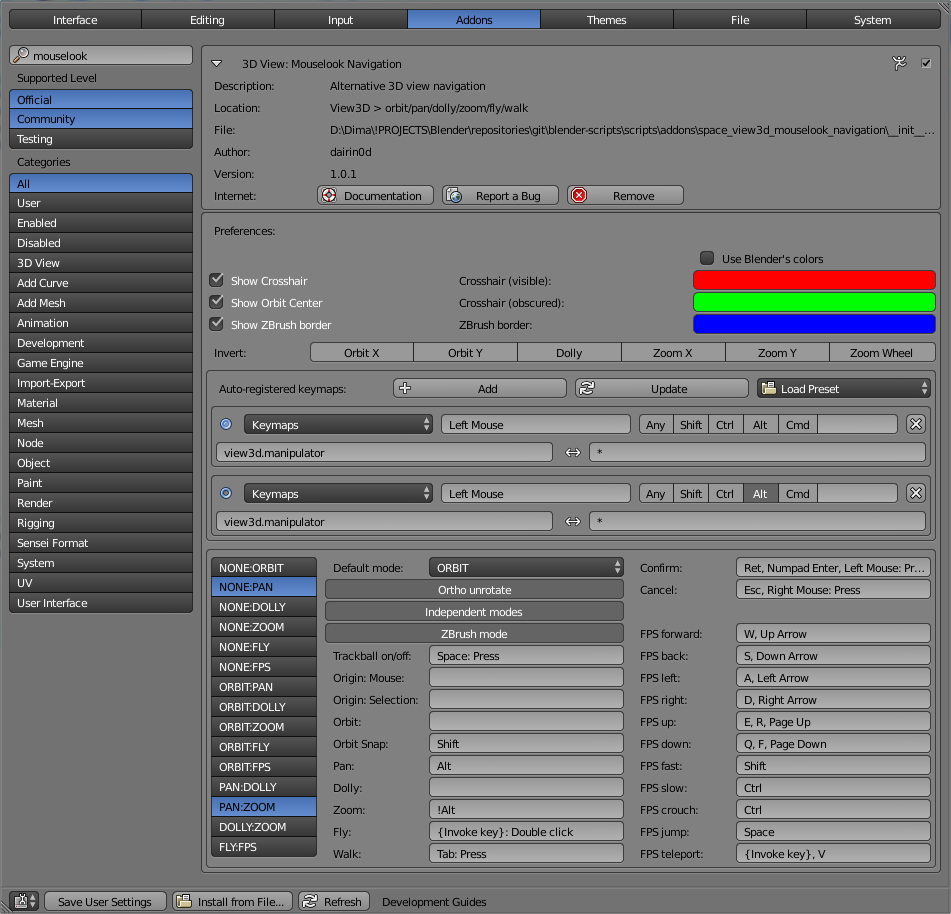
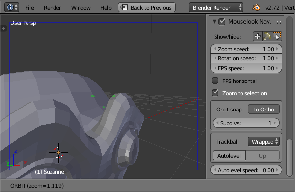

# Mouselook Navigation

## Brief overview

The addon attempts to provide better usability and customization of basic 3D viewport navigation (in particular, ZBrush mode and FPS-like movement). It's an alternative to Blender's default orbit/pan/zoom/dolly/fly/walk navigation.

Most notable features:

* ZBrush mode - mostly useful for tablet users, since it allows to use the same mouse button both for painting/sculpting and for navigation (depending on whether you clicked on geometry or on background)
* Easy switching between navigation modes without exiting the operator
* Changes to viewport can be cancelled from any mode
* FPS-like movement is available in all navigation modes
* Crosshair can be visible in all modes and has a different look when obscured
* Option to more easily prevent accidental viewport rotation in Ortho projection
* Different turntable/trackball algorithms and different fly mode (more FPS-like)

**Attention:** To avoid slowdowns, disable the "Record Z-buffer" option in the addon's preferences and close the User Preferences window.  

## Control scheme and display preferences

Fig. 1. Display preferences and keymaps setup

* ZBrush radius - in ZBrush mode, navigation will be allowed only when distance (in pixels) to the nearest geometry (anything that writes to Z-buffer, actually) is greater than this value
* ZBrush method - which method to use for determining whether the mouse is over empty space
* Use Blender's colors - if enabled, the "Themes\3D View\View Overlay" color is used for crosshair and for zbrush border; otherwise, the colors can be specified separately. As can be seen from the Fig. 2, the obscured parts of the crosshair look differently than non-obscured ones (besides the color, the obscured parts are also wider and more transparent). This might serve as a crude estimation of where in the scene the orbit center is.
* Show ZBrush border - enable/disable ZBrush border visualization
* Show Crosshair - enable/disable crosshair visualization
* Show Orbit Center - enable/disable orbit center visualization (when center of rotation differs from the orbit center)
* Invert - toggles to invert directions of the corresponding orbit/dolly/zoom components

Auto-registered keymaps:

This is the section where you can set up the ways to invoke the navigation operator, and the operator's corresponding control scheme.

* Top row:
  * "Add" button - adds one more shortcuts to the list.
  * "Update" button - updates Blender's keymaps with the specified shortcuts.
  * "Load Preset" menu - loads the specified preset (all the auto-registered shortcuts will be overridden) + updates Blender's keymaps. The presets are located in the addon's "presets" directory.
* Auto-registered keymap(s):
  * A round icon/button - click to make the corresponding shortcut active (the navigation settings below will be displayed for this shortcut). If the shortcut is already active, clicking on it will switch to using the universal navigation settings (same for all shortcuts).
  * "Keymaps" menu - here you can specify for which object modes the shortcut will be registered.
  * Key/event text field - here you can list the keys/buttons (and, optionally, the type of event) which will invoke the navigation operator.
  * Any/Shift/Ctrl/Alt/Cmd/Key modifier - here you can specify the modifiers used for this shortcut.
  * X button - click to delete the corresponding shortcut.
  * List of preceding operators - the auto-registered shortcuts will be inserted after the specified operators. * means all operators.
  * List of succeeding operators - the auto-registered shortcuts will be inserted before the specified operators. * means all operators.
* Navigation settings:
  * Transitions - allowed transitions between modes.
  * Default mode - the operator would start in this mode if other mode keys are not pressed.
  * Ortho unrotate - if enabled and view projection is Orthographic, switching from Orbit to Pan/Dolly/Zoom will snap view rotation to its initial value and will disable switching to Orbit until the operator has finished.
  * Independent modes - if enabled, each navigation mode will use its own position/rotation/zoom.
  * ZBrush mode - if enabled, the operator's default mode will be invoked only if there is no geometry under the mouse, or if the mouse is sufficiently close to the 3D View border.
  * Confirm - key(s) that confirm changes to view
  * Cancel - key(s) that cancel changes to view
  * Trackball on/off - key(s) that confirm switch between Turntable and Trackball rotation modes
  * Origin: Mouse - key(s) that force Auto Depth option for the duration of the operator
  * Origin: Selection - key(s) that force Rotate Around Selection option for the duration of the operator
  * Orbit - key(s) that switch to Orbit mode
  * Orbit Snap - key(s) that switch rotation snapping
  * Pan - key(s) that switch to Pan mode
  * Dolly - key(s) that switch to Dolly mode
  * Zoom - key(s) that switch to Zoom mode
  * Fly - key(s) that switch to Fly mode
  * Walk - key(s) that switch to Walk mode
  * FPS forward - key(s) that move view in forward FPS direction
  * FPS back - key(s) that move view in backward FPS direction
  * FPS left - key(s) that move view in left FPS direction
  * FPS right - key(s) that move view in right FPS direction
  * FPS up - key(s) that move view in upward FPS direction (automatically switches off gravity)
  * FPS down - key(s) that move view in downward FPS direction (automatically switches off gravity)
  * FPS fast - key(s) that switch FPS movement to a faster speed
  * FPS slow - key(s) that switch FPS movement to a slower speed
  * FPS crouch - key(s) for "crouching" in Walk mode (when gravity is on)
  * FPS jump - key(s) for "jumping"/"jetpack" in Walk mode (automatically switches on gravity)
  * FPS teleport - key(s) for "teleporting"/"grappling hook" in Walk mode

By default, the addon auto-registers a shortcut on the same key/button as the Blender's built-in Orbit operator.

## Side-panel settings

Fig. 2. 3D view and side-panel settings

* Mouselook Nav. toggle - enables or disables the mouse-look navigation operator.
* Show/hide - quick access to enabling/disabling the visualization of crosshair, orbit center and ZBrush border.
* Zoom speed - speed multiplier for zooming.
* Rotation speed - speed multiplier for rotation.
* FPS speed - speed multiplier for FPS movement.
* FPS horizontal - if enabled, FPS forward/backward keys move view in horizontal plane, and up/down keys move view in the world's vertical direction.
* Zoom to selection - if Rotate Around Selection is enabled in the user preferences, then Mouselook Navigation will zoom to the center of selection.
* Orbit snap
  * To Ortho - if Auto Perspective is enabled in the user preferences, then rotation snapping would switch the view to Orthographic mode.
  * Subdivs - number of intermediate angles to which the view rotation can be snapped (1 snaps to each 90 degrees, 2 snaps to each 45 degrees, and so on).
* Trackball
  * Mode - what trackball algorithm to use.
    * Center - rotation depends only on mouse speed and not on mouse position; has the most stable and predictable behavior.
    * Wrapped - like Center, but rotation depends on mouse position.
    * Blender - uses the same trackball algorithm as in Blender (in theory. In practice I haven't figured out how to make it behave exactly like in Blender).
  * Autolevel - enables or disables autolevelling in the trackball mode.
  * Up - if enabled, autolevelling would always try to orient view's up axis to world's up axis in trackball mode.
* Autolevel speed - the speed of autolevelling (autolevelling decreases the tilt of the view over time).

## Known issues

* Blender trackball mode doesn't actually behave like in Blender
* Ortho-grid/quadview-clip/projection-name display is not updated
* Rotate Around Selection might work incorrectly in scuplt/paint modes and when editing metaballs or text-curves
* Zooming/rotation around the last paint/sculpt stroke position is not supported
