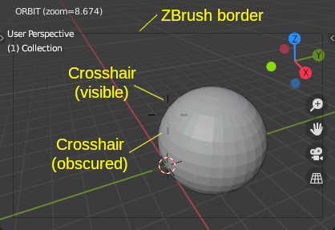
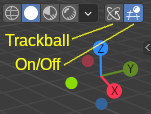
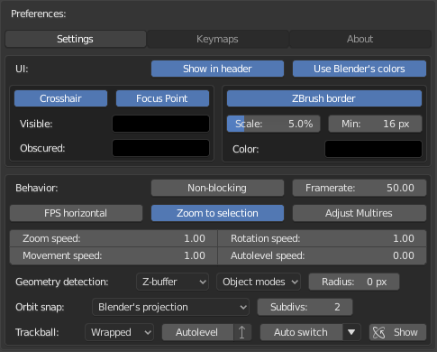
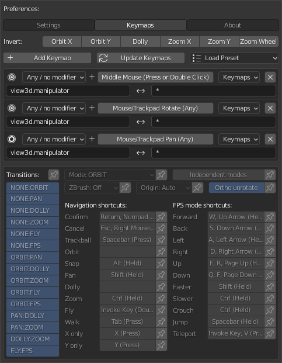
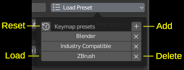
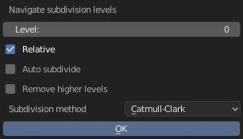

# Mouselook Navigation

* [Overview](#overview)
  * [Features](#features)
  * [3D Viewport](#3d-viewport)
  * [3D Viewport header](#3d-viewport-header)
* [Settings](#settings)
  * [UI](#ui-section)
  * [Behavior](#behavior-section)
* [Keymaps](#keymaps)
  * [Common options](#common-options)
  * [Keymap management](#keymap-management)
  * [List of keymap configurations](#list-of-keymap-configurations)
  * [Keymap-specific options](#keymap-specific-options)
* [Extras](#extras)
  * [Subdivision level navigation](#subdivision-level-navigation)
* [Known issues](#known-issues)

## Overview

The addon attempts to provide better usability and customization of basic 3D viewport navigation (in particular, ZBrush mode and FPS-like movement). It's an alternative to Blender's default orbit/pan/zoom/dolly/fly/walk navigation.

### Features

* ZBrush mode - mostly useful for tablet users, since it allows to use the same mouse button both for painting/sculpting and for navigation (depending on whether you clicked on geometry or on background)
* Easy switching between navigation modes without exiting the operator
* Changes to viewport can be cancelled from any mode
* FPS-like movement is available in all navigation modes
* Crosshair can be visible in all modes and has a different look when obscured
* Option to more easily prevent accidental viewport rotation in Ortho projection
* Option to auto-level the view when it's tilted
* Different turntable/trackball algorithms and different fly mode (more FPS-like)
* Subdivision level navigation operator

### 3D Viewport

* **Crosshair** - indicates the point around which the view rotates, and/or the focus point of the viewport
* **ZBrush border** - indicates the rectangle inside which ZBrush behavior is active (outside of the rectangle, navigation will happen regardless of the presence of geometry under the mouse)

### 3D Viewport header

* **Trackball** toggle - toggles between Trackball and Turntable orbit methods (chages Blender's "Orbit Method" preference)
* **On/Off** toggle - enables/disables Mouselook Navigation, without disabling the addon itself (this setting is saved in the .blend file, instead of addon preferences)

## Settings

### **UI** section
* **Info in header** - whether to display mode and zoom info in 3D Viewport's header during the navigation
* **Buttons in header** - whether to display Mouselook Navigation buttons in 3D Viewport's header
* **Use Blender's colors** - if enabled, Blender's *3D Viewport\View Overlay* theme color is used for crosshair and for ZBrush border
* **Crosshair** - whether to display the crosshair
  * **Focus Point** - whether to display the viewport's focus point (when it's not the same as the current orbit point)
  * **Visible** - color for the visible parts of the crosshair
  * **Obscured** - color for the obscured parts of the crosshair
* **ZBrush border** - whether to display ZBrush border
  * **Scale** - relative size of the border (percentage of viewport size)
  * **Min** - absolute size of the border (in pixels)
  * **Color** - color of the border

### **Behavior** section
* **Non-blocking** - if enabled, navigation will not block execution of other operators
* **Framerate** - update rate during the navigation (in frames per second)
* **FPS horizontal** - if enabled, FPS forward/backward moves in horizontal plane, and up/down moves in the world's vertical direction
* **Zoom to selection** - if both this and Blender's *Rotate Around Selection* preference are enabled, Mouselook Navigation will zoom to the center of selection
* **Adjust Multires** - if this and the *Fast Navigate* option (in Blender's *Sculpt* menu) are enabled, the sculpt resolution of Multires modifier will be set to 1 during the navigation in Sculpt mode (*WARNING: for high-detail meshes, this will cause lag / delays when starting or ending the navigation*)
* **Zoom speed** - speed multiplier for zooming.
* **Rotation speed** - speed multiplier for rotation.
* **Movement speed** - speed multiplier for FPS movement.
* **Autolevel speed** - the speed of autolevelling
* **Geometry detection** (affects the addon's behavior in ZBrush mode and/or when Blender's *Auto Depth* preference is enabled)
  * **Geometry detection method** - how to detect the geometry under the mouse
    * *Raycast* - uses raycasting; can detect only mesh objects (*WARNING: causes problems in Sculpt mode*)
    * *Selection* - uses Blender's selection operator (*WARNING: causes problems in Sculpt mode*)
    * *Z-buffer* - renders the viewport to a depth buffer (*WARNING: triggers a full viewport redraw; may potentially crash Blender, if other addons attempt to use wm.redraw_timer() in the same frame*)
  * **Object modes** - in which object modes geometry detection should be used
  * **Radius** - distance (in pixels) to the nearest geometry, above which ZBrush navigation is allowed
* **Orbit snap** (options for angle snapping during orbiting)
  * **Projection** - if Blender's *Auto Perspective* preference is enabled, orbit snapping would switch the view to Orthographic or Perspective mode
    * *Don't change projection* - stay in the original projection mode
    * *Blender's projection* - use Blender's default Auto Perspective behavior
    * *ON: Ortho, OFF: Perspective* - switch to Orthographic when snapping, and to Perspective otherwise
    * *ON: Ortho, OFF: Original* - switch to Orthographic when snapping, and to the initial projection mode otherwise
  * **Subdivs** - number of intermediate angles to which the view rotation can be snapped (1 snaps to each 90 degrees, 2 snaps to each 45 degrees, and so on)
* **Trackball** (options related to Trackball mode)
  * **Trackball mode** - which trackball algorithm to use
    * *Center* - rotation depends only on mouse speed and not on mouse position
    * *Wrapped* - like Center, but rotation depends on mouse position
    * *Blender* - attempts to emulate Blender's trackball behavior (though does not behave exactly the same)
  * **Autolevel** - enables or disables autolevelling in the trackball mode
    * **Up** - if enabled, autolevelling would always try to orient view's up axis to world's up axis in trackball mode
  * **Auto switch** - enables or disables automatic switching between Trackball and Turntable in certain object modes
    * **Auto Trackball modes** dropdown - in which object modes to auto-switch to Trackball
  * **Show** - if enabled, the Trackball toggle in 3D Viewport's header will be shown

## Keymaps

Here you can customize the keymaps / shortcuts used for invoking the navigation operator, and its behavior. These keymaps are automatically registered on addon initialization.

### Common options
  * **Invert** - which directions/axes should be inverted

### Keymap management
  * **Add Keymap** - adds a new keymap configuration to the list (note: this does not automatically update Blender's keymaps)
  * **Update keymaps** - updates Blender's keymaps according to the list of keymap configurations
  * **Load Preset** - a popup panel for loading and managing keymap presets
    * 
    * ***Reset*** - resets the list of presets
    * ***Add*** - saves the current setup to a new preset
    * ***Load*** - loads the specified preset (and updates Blender's keymaps)
    * ***Delete*** - deletes the specified preset
    * Presets can also be ***imported*** from and ***exported*** to the file system (the corresponding options are located in the context menu - simply right-click on any button in the Keymap presets panel)
      * If you didn't right-click on a specific preset, then the "Export" option will export the current setup

### List of keymap configurations
Each of the keymap configurations has the following elements:
* [**⊙**](a "Round button") - (un)selects the corresponding keymap
* **Modifiers** - which modifier(s) (Shift, Ctrl, Alt...) to use for this shortcut
* **Keys (events)** - key(s) and event(s) that should trigger the keymap's operator (a separate keymap will be registered for each combination)
* **Keymaps** - in which of the Blender's keymap categories the shortcuts should be registered (note: only those relevant to 3D viewport navigation are listed here)
* **X** - deletes the corresponding keymap configuration
* **Preceding operators** (left) - which operators need to have higher priority than this keymap's operator (asterisk * means all operators)
* **Succeeding operators** (right) - which operators need to have lower priority than this keymap's operator (asterisk * means all operators)

### Keymap-specific options
This section shows options for the selected keymap configuration (or the default options, if no keymap is selected). Each keymap-specific option has an **Override** toggle ([📌](a "Pin icon")), which allows to override the default value.
* **Transitions** - allowed transitions between modes
* **Mode** - keymap's default mode
* **Independent modes** - if enabled, each navigation mode will use its own position/rotation/zoom
* **ZBrush** - what type of ZBrush behavior (if any) to use for this keymap
  * *Off* - don't use ZBrush behavior
  * *Simple* - use ZBrush behavior only when no modifier keys are pressed
  * *Always* - always use ZBrush behavior
* **Origin** - what should be used as the orbit origin
  * *Auto* - determine orbit origin from Blender's preferences
  * *View* - use 3D viewport's focus point
  * *Mouse* - orbit around the point under the mouse
  * *Selection* - orbit around the selection pivot
* **Ortho unrotate** - if enabled and view projection is Orthographic, switching from Orbit to Pan/Dolly/Zoom will snap view rotation to its initial value and will disable switching to Orbit until the operator has finished
* ***Navigation shortcuts*** (keys used during the navigation)
  * **Confirm** - finish the navigation
  * **Cancel** - finish the navigation and return the viewport to how it was
  * **Trackball** - switch between Turntable and Trackball orbit methods
  * **Orbit** - switch to Orbit mode
  * **Snap** - toggle rotation snapping
  * **Pan** - switch to Pan mode
  * **Dolly** - switch to Dolly mode
  * **Zoom** - switch to Zoom mode
  * **Fly** - switch to Fly mode
  * **Walk** - switch to Walk mode
  * **X only** - use only X-axis input
  * **Y only** - use only Y-axis input
* ***FPS mode shortcuts*** (keys used for FPS-like navigation)
  * **Forward** - move forward
  * **Back** - move backward
  * **Left** - move left
  * **Right** - move right
  * **Up** - move upward (automatically switches off gravity)
  * **Down** - move downward (automatically switches off gravity)
  * **Faster** - use fast speed
  * **Slower** - use slow speed
  * **Crouch** - "crouch" in Walk mode (when gravity is on)
  * **Jump** - "jump"/"jetpack" in Walk mode (automatically switches on gravity)
  * **Teleport** - "teleport"/"grappling hook" in Walk mode

## Extras

### Subdivision level navigation

This is an operator for "navigating" between subdivision levels of *Multires / Subsurf / Subdivide* modifiers on selected objects (Blender has a similar operator called "Subdivision Set", but with fewer options). If you want to [make a shortcut](https://docs.blender.org/manual/en/latest/editors/preferences/keymap.html) for it, use the *mouselook_navigation.subdivision_navigate* operator identifier.

Warning: if you use Blender versions earlier than 2.93, you may encounter problems when trying to undo the effects of this operator in Sculpt mode.

* *Level* - the target subdivision level (if *Relative* is off) or subdivision level offset (if *Relative* is on)
* *Relative* - whether to set a specific subdivision level or to increment/decrement it
* *Auto subdivide* - automatically subdivide when necessary; also adds a subdivision modifier if the object has none (*Multiresolution* for Mesh objects in Sculpt mode, *Subdivide* for Grease Pencil objects, *Subdivision Surface* in other cases)
* *Remove higher levels* - if level is decremented, remove all higher levels
* *Subdivision method* - which method to use for subdividing
* *Show dialog* (keymap-only option) - whether to show the dialog with options or to execute the operator immediately

## Known issues

* The "Blender" trackball mode doesn't actually behave like in Blender
* Ortho-grid/quadview-clip/projection-name display is not updated
* Blender's *Rotate Around Selection* behavior is not exactly replicated in scuplt/paint modes and when editing text-curves
* Zooming/rotation around the last paint/sculpt stroke position is not supported
